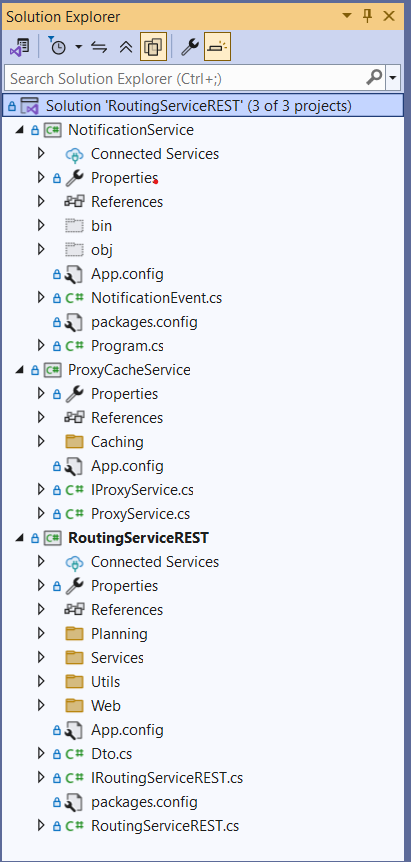
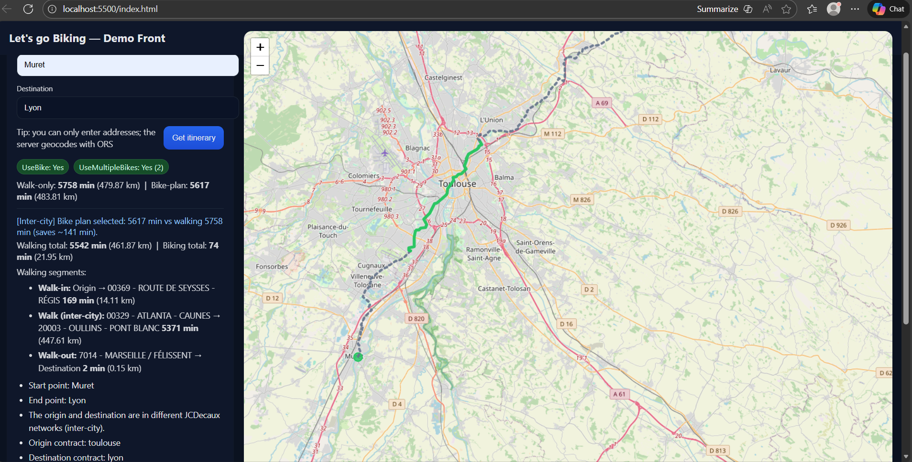
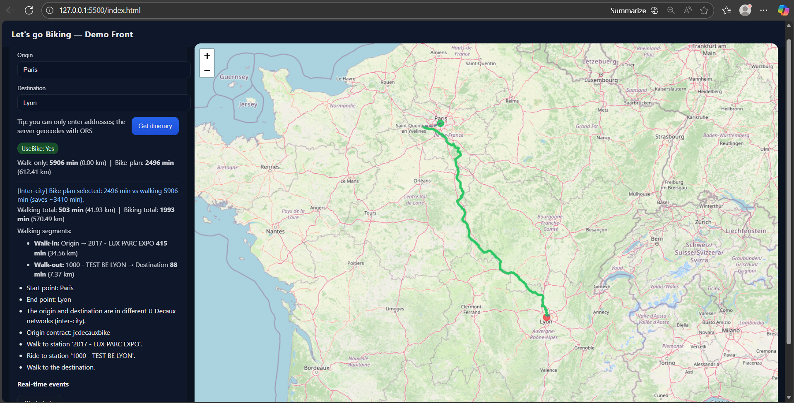
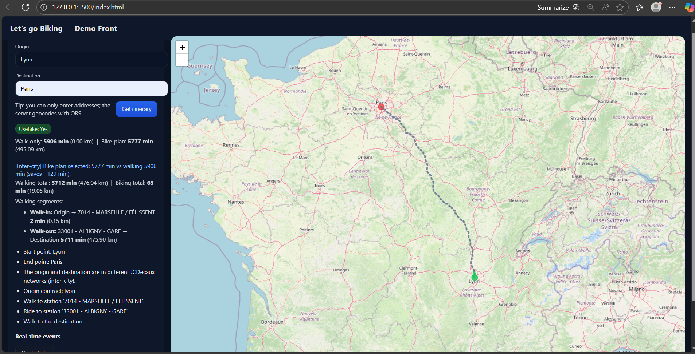
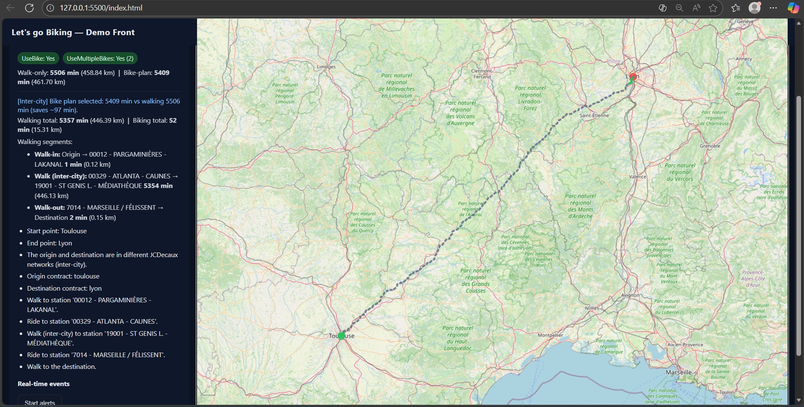
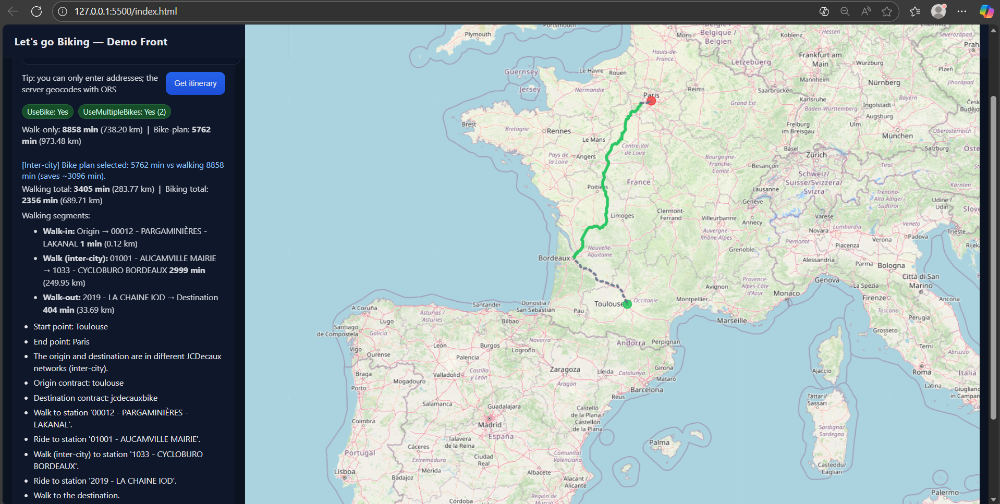
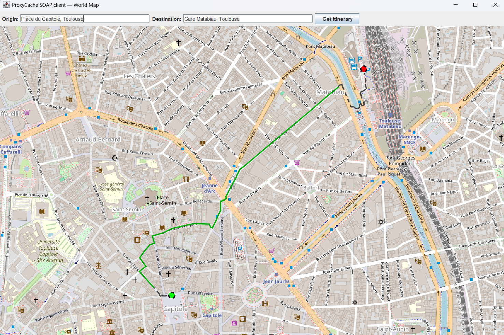

# Let’s go Biking — Full Project Documentation

This repository implements the **“Let’s go Biking”** project:

> Given an origin and a destination, compute an itinerary that uses **JCDecaux bikes** as much as possible when it is **faster than walking**, and display the result on a map.

The solution is built around:

- **C# (.NET / WCF)**  
  - `RoutingServiceREST` — REST routing server  
  - `ProxyCacheService` — SOAP proxy + generic cache  
  - `NotificationService` — ActiveMQ real-time notifications
- **Web Front-End** — HTML + JavaScript + Leaflet + STOMP over WebSocket
- **Java Heavy SOAP Client** — Maven project consuming the SOAP proxy
- **Java Map Viewer** — desktop app using JXMapViewer2 to display itineraries

This README describes:

- how to **run** all components,
- how the **routing logic** works in detail (multi-city, both-ends bike, thresholds),
- how the **proxy cache** behaves (TTL, HIT/MISS, error handling),
- how **real-time notifications** are integrated,
- how the **heavy SOAP client** and **Java world map** are implemented.

---

## Table of Contents

1. [Solution Overview](#solution-overview)  
2. [Repository Structure](#repository-structure)  
3. [Architecture](#architecture)  
4. [Self-Hosting Architecture and Execution](#self-hosting-architecture-and-execution)  
   - [How to Run the Application](#how-to-run-the-application-self-hosted)  
5. [RoutingServiceREST](#routingservicerest)  
   - [Routing Logic](#routing-logic)  
   - [Project Structure](#routingservicerest-project-structure)  
6. [ProxyCacheService (SOAP Proxy + Cache)](#proxycacheservice-soap-proxy--cache)  
7. [Real-Time Notifications (NotificationService + ActiveMQ)](#real-time-notifications-notificationservice--activemq)  
8. [Web Front-End (Leaflet + STOMP)](#web-front-end-leaflet--stomp)  
9. [Java Heavy SOAP Client & Map Viewer](#java-heavy-soap-client--map-viewer)  
10. [Routing Limitations of ORS GET Directions](#routing-limitations-of-ors-get-directions) 
11. [Test Cases](#test-cases)  


---

## Solution Overview

The project is centered around a **C# WCF REST routing server** that:

1. Geocodes the origin and destination using **OpenRouteService (ORS)**.
2. Retrieves **JCDecaux station data** via a dedicated **SOAP proxy/cache**.
3. Chooses the best combination of walking and biking:
   - walk-only,
   - origin-only bike,
   - destination-only bike,
   - both-ends bike (bike in both cities for inter-city trips).
4. Returns a detailed JSON response with:
   - durations, distances, “UseBike: Yes/No”,
   - stations used,
   - multi-segment geometry for drawing on a map.

On top of this, the solution adds:

- a **ProxyCacheService** that encapsulates all external HTTP calls and caching,  
- a **NotificationService** that pushes **real-time JCDecaux-based alerts** (weather, pollution, bikes) through **ActiveMQ topics**,  
- a **web front-end** that displays itineraries and notifications on a **Leaflet** map,  
- a **Java heavy SOAP client** that consumes the C# SOAP proxy and displays itineraries on a **world map** using **JXMapViewer2**.

---

## Repository Structure

### C# Solution (`RoutingServiceREST.sln`)

```text
Solution 'RoutingServiceREST'
├── RoutingServiceREST/          // REST routing service (WCF)
│   ├── Planning/
│   ├── Services/
│   ├── Utils/
│   ├── Web/
│   │   └── index.html
│   ├── Dto.cs
│   ├── IRoutingServiceREST.cs
│   ├── RoutingServiceREST.cs
│   └── App.config
│
├── ProxyCacheService/           // SOAP proxy and generic cache
│   ├── Caching/
│   │   ├── GenericProxyCache.cs
│   │   ├── HttpGetResource.cs
│   │   ├── JcdecauxContractsResource.cs
│   │   └── JcdecauxStationsResource.cs
│   ├── IProxyService.cs
│   ├── ProxyService.cs
│   └── App.config
│
└── NotificationService/         // ActiveMQ notification producer
    ├── NotificationEvent.cs
    ├── Program.cs
    └── App.config
````




### Java Maven Project (`ProxyCacheJavaClient`)

```text
ProxyCacheJavaClient/
├── src/
│   └── main/
│       └── java/
│           └── com/
│               └── soc/
│                   ├── MapViewerApp.java
│                   ├── RoutePainter.java
│                   ├── RouteSegment.java
│                   ├── RoutingRestClient.java
│                   ├── SegmentedRoutePainter.java
│                   └── TestProxyClient.java
├── target/
│   ├── classes/com/soc/...
│   ├── classes/com/soap/...      // generated SOAP client from WSDL
│   ├── generated-sources/jaxws
│   └── ...
└── pom.xml
```

`TestProxyClient` is the heavy SOAP client for the C# ProxyCacheService.
`MapViewerApp` + `RoutePainter` + `SegmentedRoutePainter` implement the world map visualization.

---

## Architecture

High-level architecture:

```text
                            +------------------------+
                            |   ProxyCacheService    |
                            |   (SOAP, WCF, cache)   |
                            +-----------+------------+
                                        ^
                                        |  (SOAP client call)
                                        |
Browser (Leaflet + STOMP)               |           
   |                                    |
   | REST + WebSocket           +-------v-------+
   +---------------------------> |  Routing     |
                                 | ServiceREST  |
Java Map Viewer                  | (REST server |
(ProxyCacheJavaClient)           |  + SOAP client)
   |                             +-------+-------+
   | SOAP                                |
   +-------------------------------------+
                                        |
                                +-------v-------+
                                |   ActiveMQ    |
                                |   (topics)    |
                                +-------+-------+
                                        ^
                                        |
                                +-------v-------+
                                | Notification  |
                                |   Service     |
                                +---------------+
```

* All external HTTP requests (JCDecaux, ORS) go through **ProxyCacheService**.
* **RoutingServiceREST** only talks to the proxy and never directly to the internet.
* **NotificationService** uses ProxyCacheService to fetch real JCDecaux station data and sends alerts to ActiveMQ topics.
* The **web front-end** subscribes via **STOMP** and overlays alerts on the map.
* The **Java heavy client** consumes the SOAP proxy and the REST routing service, and displays routes on a JXMapViewer map.


---

## Self-Hosting Architecture and Execution

This project fully supports **self-hosted execution**, where all backend servers run as standalone executables (without Visual Studio).  
To achieve this cleanly, two lightweight Console App hosts were added:

- `ProxyCacheService.SelfHost`
- `RoutingServiceREST.SelfHost`

The original WCF Service Library projects remain unchanged.  
They still contain all routing, caching, geocoding, and JCDecaux logic — and can be debugged normally in Visual Studio.  
The SelfHost apps simply provide a minimal, clean hosting layer that starts the services.

### Why this approach?
- **Services can run directly as executables** (required for demo/exam).  
- **Debugging remains untouched** — development still happens in the WCF projects.  
- **Architecture stays clean**:  
  - WCF libraries = service logic  
  - SelfHost apps = hosting + configuration  
- **No risk of breaking the working implementation.**

This approach gives the best of both worlds.

---

### `ProxyCacheService.SelfHost`

This console app:

- creates a `ServiceHost` for `ProxyService`
- applies a `BasicHttpBinding`
- adds SOAP + MEX endpoints
- loads API keys from `App.config`
- listens at:

```
http://localhost:8734/Design_Time_Addresses/ProxyCacheService/Service1/

```

---

### `RoutingServiceREST.SelfHost`

This console app:

- creates a `WebServiceHost` for `RoutingService`
- configures a `WebHttpBinding` (REST + JSON)
- attaches `WebHttpBehavior`
- enables debugging details
- listens at:

```
http://localhost:8733/Design_Time_Addresses/RoutingServiceREST/Service1/

```

---

### Output (Generated Executables)

After building the solution, the following executables are created:

```
ProxyCacheService.SelfHost/bin/Debug/ProxyCacheService.SelfHost.exe
RoutingServiceREST.SelfHost/bin/Debug/RoutingServiceREST.SelfHost.exe
```

These run independently of Visual Studio.

---

### URL ACL Registration (one-time setup)

Windows does not allow services to bind to HTTP prefixes unless permitted.  
Therefore, these commands were executed once in an elevated CMD:

```bat
netsh http add urlacl url=http://+:8734/Design_Time_Addresses/ProxyCacheService/Service1/ user=ecomputer
netsh http add urlacl url=http://+:8733/Design_Time_Addresses/RoutingServiceREST/Service1/ user=ecomputer
```

This permanently authorizes the user `ecomputer` to run both servers.

---

### Automated Startup & Shutdown Scripts

Three utility scripts were added at the solution root:

#### `start_all.bat`

Starts:

* ProxyCacheService (SOAP)
* RoutingServiceREST (REST)
* NotificationService (ActiveMQ alerts)

Each opens in its own console window.

#### `start_frontend.bat`

Launches the front-end:

* starts a lightweight Python HTTP server
* automatically opens:

```
http://localhost:5500/index.html
```

#### `stop_all.bat`

Stops all backend processes using `taskkill`.

---

## How to Run the Application (Self-Hosted)

After URL ACL setup, running the full system is very simple:

### **1. Start backend services**

```
start_all.bat
```

### **2. Start the front-end**

```
start_frontend.bat
```

Browser opens automatically at:

```
http://localhost:5500/index.html
```

### **3. Use the application normally**

* pick origin/destination
* view walking / bike plan
* receive realtime notifications
* compare with Java heavy client

### **4. Stop all backend services**

```
stop_all.bat
```
---

## Summary

* Clean separation between service logic and hosting logic
* Visual Studio debugging stays fully intact
* Executables allow independent runtime without VS
* Scripts automate the entire workflow
* Architecture mirrors real WCF deployment patterns

---

## RoutingServiceREST

One important aspect of the design is that **RoutingServiceREST acts in two roles** at the same time:

1. **REST server** — it exposes the `/itinerary` endpoint consumed by the web front-end and by the Java map viewer.  
2. **SOAP client** — it calls `ProxyCacheService` (via the generated `ProxyRef.ProxyServiceClient`) to obtain JCDecaux contracts, station data, and cached HTTP responses.

The RoutingServiceREST project implements the routing logic as a WCF REST service.  
It exposes the `/itinerary` endpoint, which computes the multimodal (walk + bike) route using JCDecaux station data (via the ProxyCacheService) and ORS routing.  

Because of **this dual nature**, the SelfHost version of the service defines all REST hosting logic in `Program.cs`, while its `App.config` contains only the SOAP client configuration (basicHttpBinding + endpoint). This keeps responsibilities clean and avoids mixing server and client concerns.


### Main Endpoint: `POST /itinerary`

**Request model (`ItineraryRequest`)**:

* `Origin` (string) — origin address (free-text)
* `Destination` (string) — destination address (free-text)
* optional `OriginLat`, `OriginLon`, `DestLat`, `DestLon`
  (if coordinates are already known)
* `Debug` (bool) — if `true`, the response contains additional diagnostic information.

**Response model (`ItineraryResponse`)** (simplified):

* `Success` (bool)
* `Message` (string) — human-readable summary
* `UseBike` (bool) — whether the selected plan uses bikes
* `OriginContract`, `DestinationContract`
* `WalkOnlyDurationSec`, `WalkOnlyDistanceMeters`
* `BikePlanDurationSec`, `BikePlanDistanceMeters`
* `Segments[]` — list of segments (walk or bike), each with:

  * `Mode` (`"walk"` / `"bike"`)
  * `Contract` (for bike segments)
  * `FromName`, `ToName`
  * `DistanceMeters`, `DurationSec`
  * `Coords` — polyline as `[lat, lon]` pairs
* Legacy fields kept for compatibility:

  * `Walk1Coords`, `BikeCoords`, `Walk2Coords`
* If `Debug = true`:

  * resolved coordinates for origin/destination,
  * top-3 candidate stations for pickup/dropoff with distances,
  * raw station data snippets.

---

### Routing Logic

The routing core is implemented as a set of strategies:

1. **Walk-only plan**
2. **Origin-only bike plan**
3. **Destination-only bike plan**
4. **Both-ends bike plan** (bike in both cities, plus a long inter-city walk)

All strategies share:

* the same geocoded origin/destination,
* the same JCDecaux station dataset (loaded via the proxy),
* the same ORS routing service (for distances and geometry).

The `ItineraryPlanner` compares the **total duration** of each feasible plan against the **baseline walk-only duration** and selects the best one.

#### 1. Geocoding

* Uses **OpenRouteService Geocoding API**.
* For one-word queries like `"Lyon"` the system **biases towards the city**, not streets named "Lyon", to avoid weird results.
* Debug mode in Postman returns the final resolved coordinates for both origin and destination.

#### 2. Station selection (bikes & stands)

For each city/contract, the service:

* identifies candidate stations near origin and destination,
* filters them according to live availability:

  * pickup station → must have `Bikes > 0`,
  * dropoff station → must have `Stands > 0`.

Example: **Plaisir → Orléans** (same contract `jcdecauxbike`):

* Station `501 - BEE PLAISIR` has 0 bikes (but 1 stand),
* Station `2017 - LUX PARC EXPO` has 3 bikes and 2 stands.

The planner chooses `2017 - LUX PARC EXPO` as pickup, ignoring the empty station:

```text
UseBike: Yes
Walk-only: 1509 min (125.76 km) | Bike-plan: 547 min (142.93 km)
Start point: Plaisir
End point: Orléans
Origin contract: jcdecauxbike
Destination contract: jcdecauxbike
Walk to station '2017 - LUX PARC EXPO'.
Pick up a bike and ride to station 'SALON RNTP'.
Drop the bike and walk to the destination.
```

In this project, **JCDecaux networks** are associated to the origin and destination purely based on **geographic proximity**,
not on the `cities` list declared in the official contracts.

At runtime, the routing service loads **all JCDecaux stations from all contracts** and selects
the nearest station to the origin coordinates, and the nearest station to the destination.

The contracts of these two stations become the `OriginContract` and `DestContract`.

This distance-based approach automatically supports *suburbs* and *nearby towns*:
 - for example, when the user starts in *Muret*, the system will legitimately pick a station from
   the **toulouse** contract because it is the closest JCDecaux network in terms of distance,
   even if “Muret” is not explicitly listed as a city in that contract
   * Start point: `Muret` 
   * Origin contract: `toulouse`



#### 3. Inter-city multi-contract logic

For long trips where origin and destination are in **different contracts**, the planner evaluates three candidate strategies:

1. **Origin-only bike**

   * walk → bike within origin city → long walk from last station to the final destination.

2. **Destination-only bike**

   * long walk from origin to destination city → bike only near the end → short walk to final point.

3. **Both-ends bike**

   * walk → bike within origin city → long walk between cities → bike again inside destination city → walk to final destination.

Internally, each strategy is implemented in its own class:

* `OriginOnlyPlan`
* `DestinationOnlyPlan`
* `BothEndsPlan`
* `WalkOnlyPlan`

`ItineraryPlanner` runs these strategies, gathers candidate plans, and chooses the **fastest** feasible one.

#### 4. Selection criteria

* Baseline = **walk-only duration**.

* A bike plan is accepted **only if**:

  * it is strictly faster than walk-only, and
  * it beats it by at least a small safety margin (≈ 60 seconds).

* For the **both-ends plan**, there is a **higher margin** (≈ 120 seconds).
  This avoids generating an overly complex multimodal route for very small gains.

#### 5. Examples

#### Paris → Lyon (contract `jcdecauxbike`)

When traveling from **Paris to Lyon**, there exists a synthetic contract `jcdecauxbike` with stations near both ends. The route may look like:

```text
UseBike: Yes
Walk-only: 5905 min | Bike-plan: 2496 min
Start point: Paris
End point: Lyon
Origin contract: jcdecauxbike
The origin and destination are in different JCDecaux networks (inter-city).
Walk to station '2017 - LUX PARC EXPO'.
Ride to station '1000 - TEST BE LYON'.
Walk to the destination.
```

The `stations?contract=jcdecauxbike` endpoint confirms the availability and coordinates of these stations.



#### Lyon → Paris (asymmetric availability)

From **Lyon to Paris**, the reverse route is **not symmetrical** because the closest station near Lyon in this synthetic contract has no bikes available. Consequently, the planner chooses to:

* use the **real `lyon` contract** near the origin,
* take a long walk towards Paris after leaving the Lyon network,
* and not use bikes at the Paris side.

```text
UseBike: Yes
Walk-only: 5905 min | Bike-plan: 5777 min
Start point: Lyon
End point: Paris
Origin contract: lyon
The origin and destination are in different JCDecaux networks (inter-city).
Walk to station '7014 - MARSEILLE / FÉLISSENT'.
Ride to station '33001 - ALBIGNY - GARE'.
Walk to the destination.
```


#### Toulouse → Lyon (multiple bike segments)

An inter-city route where both sides have JCDecaux networks:

```text
UseBike: Yes
Walk-only: 5506 min (458.85 km) | Bike-plan: 5409 min (461.70 km)
Start point: Toulouse
End point: Lyon
Origin contract: toulouse
Destination contract: lyon
Walk to station '00012 - PARGAMINIERES - LAKANAL'.
Ride to station '00329 - ATLANTA - CAUNES'.
Walk (inter-city) to station '19001 - ST GENIS L. - MÉDIATHÈQUE'.
Ride to station '7014 - MARSEILLE / FÉLISSENT'.
Walk to the destination.
```

The **Segments[]** array expresses this clearly as four segments: walk, bike, walk, bike, walk.



##### Toulouse → Paris (both-ends bike)

Another example where using bikes at both ends is clearly beneficial:

```text
UseBike: Yes
Walk-only: 8855 min (737.88 km) | Bike-plan: 5756 min (971.02 km)
MVP OK — both-ends bike
Start point: Toulouse
End point: Paris
Origin contract: toulouse
Destination contract: jcdecauxbike
Walk to station '00012 - PARGAMINIERES - LAKANAL'.
Ride to station '00318 - EGLISE AUCAMVILLE'.
Walk (inter-city) to station '1033 - CYCLOBURO BORDEAUX'.
Ride to station '2019 - LA CHAINE IOD'.
Walk to the destination.
```


##### No network (negative examples)

* **Bucharest → Bucharest**
  There is no JCDecaux network near Bucharest; the service returns `Success=false` with a clear message stating that no useful network is available near origin/destination.


#### 7. Multimodal geometry and Segments[]

The service **always** returns at least one polyline, even in walk-only cases:

* if no bike plan is selected → returns **walk-only** geometry between origin and destination;
* if a bike plan is selected → returns:

  * `Walk1Coords` (origin to pickup),
  * `BikeCoords` (pickup to dropoff),
  * `Walk2Coords` (dropoff to destination),
  * and a more general `Segments[]` array that can express any number of segments.

Each element in `Segments[]` has:

* `Mode`: `"walk"` or `"bike"`,
* `Contract`: JCDecaux contract for this bike segment (if any),
* `FromName` / `ToName` (station or city names),
* `DistanceMeters`, `DurationSec`,
* `Coords`: list of `[lat, lon]`.

This general structure is used both by the **web front-end** and by the **Java map viewer**.

#### 8. Debug mode

When `Debug=true`, the response includes:

* the resolved geocoded coordinates for origin and destination,
* the top 3 candidate stations for pickup/dropoff (with distances),
* additional information about why certain plans were rejected.

This is extremely useful during development and for explaining decisions during the oral defense.

---

### RoutingServiceREST Project Structure

The routing project is organized into clear modules.

#### Root Level

* `RoutingServiceREST.cs`
  Main WCF service implementing `IRoutingServiceREST`. Handles REST entry points, CORS, and delegates work to internal services.

* `IRoutingServiceREST.cs`
  Interface describing the REST endpoints (`/itinerary`, `/contracts`, `/stations`, `/ping`, `OPTIONS /itinerary`).

* `Dto.cs`
  Contains all shared data contracts:

  * `ItineraryRequest`, `ItineraryResponse`,
  * JCDecaux models (`JcdecauxStation`, `Position`, `Availabilities`, etc.),
  * segment DTOs, debug models.

* `App.config`
  WCF configuration: service endpoints, behaviors, bindings, and JSON serialization settings.

#### `Planning/`

Implements the **strategy pattern** for routing:

* `ItineraryPlanner.cs`
  Orchestrator that invokes all route strategies and selects the best plan.

* `PlannerOptions.cs`
  Configuration of thresholds and advantages:

  * network radius,
  * origin/destination walking radius,
  * inter-city distance cutoff,
  * time advantages required for choosing bike vs walk-only,
  * etc.

* `StationContext.cs`
  Holds origin/destination contracts, station lists, and precomputed nearest station candidates.

* `ResponseBuilders.cs`
  Converts internal plan objects into `ItineraryResponse` with all durations, distances, stations, text messages, and segments.

* `OriginOnlyPlan.cs`, `DestinationOnlyPlan.cs`, `BothEndsPlan.cs`, `WalkOnlyPlan.cs`
  Represent each route strategy, computing its own segments and durations using ORS.

#### `Services/`

Encapsulates all calls to external HTTP APIs and the proxy:

* `ProxyFactory.cs`
  Creates instances of `ProxyRef.ProxyServiceClient`, the WCF SOAP client for `ProxyCacheService`.

* `IGeocodingService.cs`, `OrsGeocodingService.cs`
  Interface and implementation for ORS geocoding.

* `IRoutingCoreService.cs`, `OrsRoutingService.cs`
  Interface and implementation for ORS directions (returns durations, distances, polylines).

* `IStationRepository.cs`, `JcdecauxStationRepository.cs`
  Interface and implementation that fetch and parse JCDecaux contracts and station lists via ProxyCacheService.

#### `Utils/`

Small stateless helpers:

* `GeoMath.cs`
  Haversine distance calculations and other geometric helpers.

* `StationPickers.cs`
  Helpers for finding:

  * nearest stations,
  * nearest station with bikes,
  * nearest station with stands,
  * top-k candidates.

* `QueryHeuristics.cs`
  Functions to detect if a query is likely a city, to tweak ORS geocoding parameters.

#### `Web/`

* `index.html`
  Standalone demo front-end (see [Web Front-End](#web-front-end-leaflet--stomp)).

---

## ProxyCacheService (SOAP Proxy + Cache)

`ProxyCacheService` is a WCF SOAP service that acts as:

* a **generic resource cache** (for JCDecaux contracts/stations),
* a **URL-based HTTP cache** (for arbitrary GET requests),
* the **only component** that knows about external APIs and API keys.

### Goals

* Avoid hitting public APIs (**JCDecaux**, **ORS**) too often,
* Centralize HTTP logic (add API key, manage headers, handle errors),
* Make the routing service simpler and more testable,
* Provide **observability** via `Status()` and JSON metadata.

### Caching Components

#### `Caching/GenericProxyCache<T>`

* Generic wrapper around `MemoryCache`.
* Keys are strings (e.g. `jc:stations:lyon`).
* If a key is missing, it creates a new `T(cacheKey)` and inserts it with a configured TTL.
* Used for:

  * `JcdecauxContractsResource`
  * `JcdecauxStationsResource`

#### `Caching/HttpGetResource`

Represents a raw HTTP GET response:

* `Url`
* `Content` (string)
* `StatusCode`
* `CreatedUtc`

It also injects the ORS Bearer token when necessary.

#### `Caching/JcdecauxContractsResource` & `JcdecauxStationsResource`

* `JcdecauxContractsResource`
  Fetches the list of JCDecaux contracts using the API key; cached for longer (e.g. 1 hour) since it changes rarely.

* `JcdecauxStationsResource`
  Fetches stations for a given contract (e.g. `lyon`, `toulouse`); cached for a short time (e.g. 30 seconds) because bike availability changes quickly.

### SOAP Contract: `IProxyService`

Key operations:

* **URL caching**

  * `string Get(string url)`
  * `string GetWithTtl(string url, double ttlSeconds, bool forceRefresh, bool extendTtl)`
  * `string GetWithMeta(string url, double ttlSeconds)`

* **Cache management**

  * `void Evict(string url)`
  * `void EvictGeneric(string cacheKey)`
  * `string Status()` — JSON with `hits`, `misses`, `items`.

* **Generic JCDecaux helpers**

  * `string GetJcdecauxContractsGeneric(double ttlSeconds)`
  * `string GetJcdecauxStationsGeneric(string contract, double ttlSeconds)`

### URL Cache Behavior

* Only **successful HTTP 200 responses** are cached.
* An invalid URL or error status code is never cached.

Example:

```text
GetWithMeta("https://api.jcdecaux.com/vls/v3/stations?contract=__invalid__", 30)
```

First call ⇒ `"MISS_NO_CACHE"`
Second call (immediately) ⇒ still `"MISS_NO_CACHE"`

This proves that 4xx/5xx responses are **not cached**.

For a valid URL:

```text
GetWithMeta("https://api.jcdecaux.com/vls/v3/contracts", 60)
```

* First call: `"MISS->CACHED"` with `ageSeconds` absent or 0.
* Second call 12s later: `"HIT"` with `ageSeconds: 12`, still under 60.

### Default TTL Policy

* JCDecaux **contracts** (`GetJcdecauxContractsGeneric`): ~3600s (1 hour).
* JCDecaux **stations** (`GetJcdecauxStationsGeneric`): ~30s.
* ORS **geocoding** (via `GetWithTtl`): long TTL (e.g. 24 hours).
* ORS **directions**: short TTL (e.g. 2 minutes).

The TTL is enforced **server-side** inside the routing service when calling these proxy methods, not by the client/front-end.

`Status()` returns:

* `hits`
* `misses`
* `items` (number of entries currently in `MemoryCache.Default`, including both URL cache and generic cache entries).

### Example Cache Scenario (from tests)

Sequence:

```text
GetJcdecauxStationsGeneric("lyon", 60)
GetJcdecauxStationsGeneric("toulouse", 60)
GetJcdecauxStationsGeneric("toulouse", 60)
```

Console output:

```text
[11:31:41] Cache MISS for key 'jc:stations:lyon'
[11:31:50] Cache MISS for key 'jc:stations:toulouse'
[11:31:55] Cache HIT for key 'jc:stations:toulouse'
```

This proves that TTL and generic caching are working as intended.

---

## Real-Time Notifications (NotificationService + ActiveMQ)

This feature simulates external real-time events (weather, pollution, bike availability) and displays them on the map during an itinerary.

`NotificationService` acts purely as a SOAP client: it does not host any WCF service, but simply calls `ProxyCacheService` using the binding defined in its App.config.  
The `ALERT_CONTRACT` setting determines which JCDecaux city is monitored when generating bike events for ActiveMQ.

### Components

* `NotificationService` (C# console app)
* **ActiveMQ** broker (topics)
* Web front-end (`index.html`) with JavaScript **STOMP** client
* ProxyCacheService (for real JCDecaux data)

### Event Types

`NotificationService` periodically sends three event types:

* **meteo** — short-term weather alerts,
* **pollution** — air quality alerts,
* **bikes** — JCDecaux bike availability alerts.

All events are sent as JSON messages to ActiveMQ topics:

* `/topic/meteo`
* `/topic/pollution`
* `/topic/bikes`

### Bike Alerts with Real JCDecaux Data

For **bike alerts**, NotificationService:

1. Calls `ProxyCacheService` using the generated `ProxyServiceClient`.
2. Invokes `GetJcdecauxStationsGeneric(contract, ttlSeconds)` with the contract configured in `App.config` (`ALERT_CONTRACT`, e.g. `toulouse`, `lyon`, `bruxelles`).
3. Parses the returned JSON.
4. Randomly picks one station.
5. Reads:

   * station name,
   * number of available bikes,
   * number of available stands,
   * latitude/longitude.
6. Computes a severity level (`info`, `warning`, `danger`) based on bikes/stands.
7. Sends a JSON payload to `/topic/bikes` such as:

```json
{
  "type": "bikes",
  "contract": "toulouse",
  "stationName": "00012 - PARGAMINIERES - LAKANAL",
  "bikes": 3,
  "stands": 2,
  "severity": "warning",
  "lat": 43.6034,
  "lon": 1.4396,
  "timestamp": "2025-11-22T14:55:00Z"
}
```

By just changing `ALERT_CONTRACT` in `App.config`, the same code can monitor any JCDecaux city.

### Web Front-End Integration

In the browser:

* a STOMP client connects to `ws://localhost:61614/stomp`,
* the user can toggle subscriptions for:

  * Meteo
  * Pollution
  * Bikes
* received events are:

  * appended to a **“Real-time events”** list with color coding:

    * blue = info
    * yellow = warning
    * red = danger
  * displayed as markers on the map:

    * **Meteo** → near origin
    * **Pollution** → near destination
    * **Bikes** → at the real station coordinates (if provided); otherwise fallback to:

      * pickup station,
      * dropoff station,
      * midpoint of the route.

Clicking an event in the list centers the map on the corresponding marker.

Connection is started explicitly from the front-end via a **“Start alerts”** button, so events are only received when the user wants them.

---

## Web Front-End (Leaflet + STOMP)

The web UI is a single `index.html` file served statically (e.g. via VS Code Live Server).

### Features

* Simple form with:

  * `Origin` input
  * `Destination` input
  * “Get itinerary” button

* Calls `RoutingServiceREST`:

  ```js
  fetch("/itinerary", {
    method: "POST",
    body: JSON.stringify({ Origin, Destination, Debug }),
    ...
  });
  ```

* Displays:

  * origin and destination markers (green / red),
  * station markers for pickup and dropoff (blue or custom icons),
  * route polyline:

    * **walking** segments: gray, dashed,
    * **biking** segments: green, solid.

* Shows textual explanation:

  * `UseBike: Yes/No`,
  * walk-only vs bike-plan durations and distances,
  * contracts involved (origin/destination),
  * human-readable instructions (“Walk to station X”, “Ride to station Y”, etc.).

* Integrates notifications:

  * “Start alerts” button to initiate STOMP connection,
  * real-time events list (with colors),
  * markers for meteo/pollution/bike alerts.

* **Adaptive zoom**: adjusts map bounds to cover all coordinates in the selected itinerary.

### Implementation Notes

* The back-end always includes route geometry in the response, even when no bike is used.
* The `Debug` flag only affects developer information (top-3 candidate stations, resolved coordinates, etc.); it does **not** affect the geometry or segments.

---

## Java Heavy SOAP Client & Map Viewer

The **ProxyCacheJavaClient** project demonstrates two things:

1. A **heavy SOAP client** generated from the C# `ProxyCacheService` WSDL;
2. A **world map** that visualizes itineraries returned by `RoutingServiceREST`.

### Project Structure

`src/main/java/com/soc` contains:

* `TestProxyClient` — demo SOAP client for the proxy.
* `RoutingRestClient` — small REST client for `RoutingServiceREST`.
* `MapViewerApp` — Swing application using JXMapViewer2.
* `RouteSegment` — data model mirroring `Segments[]` from the REST response.
* `RoutePainter` / `SegmentedRoutePainter` — JXMapViewer painters drawing walking/biking paths differently.

Generated SOAP proxies from the WSDL live under `target/generated-sources/jaxws` and are compiled into `target/classes/com/soap/...`.

### SOAP Client (TestProxyClient)

The Java project uses `jaxws-maven-plugin`:

* WSDL of `ProxyCacheService` is imported in `pom.xml`.
* `mvn generate-sources` generates client classes under `com.soap.proxycache.client.generated`.

`TestProxyClient` demonstrates:

1. **Generic JCDecaux cache**

   * Calls `getJcdecauxContractsGeneric(3600)` and `getJcdecauxStationsGeneric("lyon", 30)` via SOAP.
   * Receives raw JSON strings and prints them.

2. **URL-based cache with HIT/MISS + Stats**

   * Picks a URL, e.g. `https://api.jcdecaux.com/vls/v3/contracts`.
   * Calls `getWithMeta(url, 30)` twice and prints:

     * first call → `"MISS->CACHED"` and `Stats()` shows `hits:0, misses:1`,
     * second call → `"HIT"` and `Stats()` shows `hits:1, misses:1`.
   * Calls `evict(url)` to remove the cache entry.
   * Third call → `"MISS->CACHED"` again, `Stats()` shows `hits:1, misses:2`.

This confirms from the **Java** side that:

* The C# proxy:

  * injects API keys correctly,
  * performs HTTP calls,
  * caches responses with TTL,
  * counts hits/misses and exposes them via SOAP.
* The Java client only sees SOAP operations, without dealing with low-level HTTP or API keys.

### Java Map Viewer (MapViewerApp)

The map viewer is a Swing application using **JXMapViewer2** (a fork of JMapViewer) to render OpenStreetMap tiles.

**Workflow:**

1. User enters **origin** and **destination** in the UI.

2. `RoutingRestClient` sends a `POST /itinerary` request to `RoutingServiceREST`.

3. The response is parsed into `RouteSegment` objects:

   * each segment corresponds to one element of `Segments[]`,
   * each has a `mode`, `coords`, distance, duration, and optional contract.

4. `SegmentedRoutePainter` draws:

   * **walking** segments as dashed gray polylines,
   * **biking** segments as solid green polylines.

5. The map:

   * displays markers for origin and destination (green/red),
   * automatically adjusts zoom to fit the entire route,
   * can be used for short city trips and long inter-city paths (e.g. Paris → Lyon).

#### **Visual Consistency Between Front-End and Java Map Viewer**

To demonstrate that the Java Map Viewer correctly interprets the routing geometry returned by the REST service, the following images show the *same itinerary* displayed both in the browser (Leaflet front-end) and in the Java desktop application (JXMapViewer2).
Both visualizations use the same `Segments[]` data returned by the service, ensuring **identical walking and biking paths**, markers, and overall shape of the computed route.




---

## Routing Limitations of ORS GET Directions

The project currently uses the **GET** variant of the ORS Directions API:

```text
https://api.openrouteservice.org/v2/directions/{profile}?start={lon,lat}&end={lon,lat}
```

Limitations:

* Only supports **start** and **end**; no intermediate via points.
* Cannot express advanced options like:

  * avoiding ferries,
  * avoiding certain road types,
  * preference tuning (`shortest`, `fastest`),
  * complex `options.avoid_features`.

As a result, for very long routes (e.g. **Madrid → Lyon**), ORS may choose a path containing a **ferry** if it considers it optimal, and there is no way to disable this using GET requests.

### Future Direction: Switch to POST Directions API

The **POST** Directions API supports a JSON body:

```json
{
  "coordinates": [[lon1, lat1], [lon2, lat2]],
  "preference": "fastest",
  "options": {
    "avoid_features": ["ferries"]
  }
}
```

Moving to POST would allow:

* avoiding ferries explicitly,
* customizing routing preferences,
* potentially adding more control for multi-segment routes.

---

## Test Cases

Some representative journeys used to validate the system:

### Inside France

* `Gare Part-Dieu, Lyon` → `Place Bellecour, Lyon`

  * Single-city (`lyon` contract) with bikes.
  * Expected: `UseBike: Yes`, reasonable walking segments, proper station choices.

* `Place du Capitole, Toulouse` → `Gare Matabiau, Toulouse`

  * Single-city (`toulouse` contract).
  * Expected: `UseBike: Yes`.

### Inter-city in France

* `Toulouse` → `Lyon`

  * Inter-city, `toulouse` and `lyon` contracts.
  * Expected: multiple segments (walk & bike), as shown in examples above.

* `Toulouse` → `Paris` and `Paris` → `Toulouse`

  * Tests both-ends bike logic and asymmetry.

* `Muret` → `Lyon`

  * Uses Toulouse network plus inter-city logic; currently works well.

* `Muret` → `Paris`

  * Could benefit from passing through Lyon or other intermediate cities in future multi-hub extension (not implemented yet).

### Outside France / other contracts

* `Aldi, Dublin` → `Trinity College Dublin, Dublin`

  * The planner selects the Dublin contract and uses nearby stations with available bikes and stands.

* `Grand Place, Brussels` → `Parc du Cinquantenaire, Brussels`

  * `bruxelles` contract; bikes should be used if they are close.

* `Rue de l'Ecuyer 19, Bruxelles` → `Galeries Royales Saint-Hubert, Bruxelles`.

* `Placa del Doctor Torrens, Valencia, Spain` →
  `Centro de Especialidades El Grao, Valencia, Spain`

  * Tests Spanish JCDecaux network (Valencia).

* `Madrid` → `Lyon`

  * Long distance; ORS may select a ferry route. Used to illustrate GET limitations.

* `Brindas, France` → `Bellecour, Lyon`

  * Although Brindas is far from most Lyon stations, the planner finds a valid destination-side station within threshold.
  * Expected: bike usage only for the destination side via the lyon contract.
  * The origin-side remains walk-only, but the dropoff uses a Lyon station close to Bellecour.

These test cases confirm:

* network detection and thresholds,
* station selection based on availability,
* inter-city multi-contract logic,
* correct behavior when no bikes/network exist.

---

## Final Notes

This project goes **well beyond** the minimum requirements:

* full **multimodal routing** (walk + bike) with inter-city scenarios,

* **generic proxy + cache** with detailed observability,

* **real JCDecaux-driven alerts** integrated through **ActiveMQ** and **STOMP**,

* dual visualization:

  * **web front-end** (Leaflet),
  * **Java desktop map viewer** (JXMapViewer2),

* and a **heavy SOAP client** in Java that demonstrates cross-language interoperability with the C# SOAP service.

All components have been carefully tested with a wide range of real European cities and varied contracts, and the codebase is structured to be easily extendable for future improvements, such as multi-hub routing and richer ORS POST usage.

